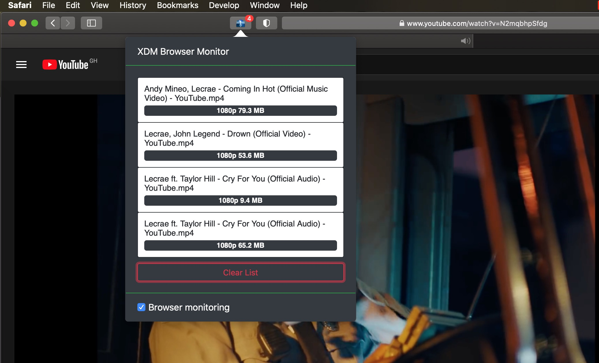

	
	<h2 align="center">XDM Extension for Safari</h2>

**X**treme **D**ownload **M**anager (XDM) is a powerful tool to increase download speeds up to 500%, save streaming videos from YouTube, DailyMotion, Facebook, Vimeo, Google Video and 1000+ other websites, resume broken/dead downloads, schedule and convert downloads. 
<a href="http://xdman.sourceforge.net" target="_blank">Download XDM</a>

### Installation
1. Make sure you have XDM installed. 
<a href="http://xdman.sourceforge.net" target="_blank">Download XDM</a>
2. Download and unzip the extension. 
<a href="https://github.com/jayluxferro/XDM-Browser-Extension/releases/download/v1.0.0/XDM.Browser.Extension.app.zip" target="_blank">Download XDM Safari Extension</a>
3. Drag and drop the application into your /Applications folder.
4. Launch the XDM Extension app.

**NB:** If the extension doesn't show in your browser, allow the use of unsigned extension in the 'Develop' menu of your Safari browser.

### Development
1. Clone and build project with Xcode 12 or greater.
2. Enable "**Develop**" mode in Safari.
3. Allow unsigned extension.
4. Build and run the project to install the extension.

### Acknowledgement
<a href="https://github.com/subhra74/xdm" target="_blank">https://github.com/subhra74/xdm</a>
